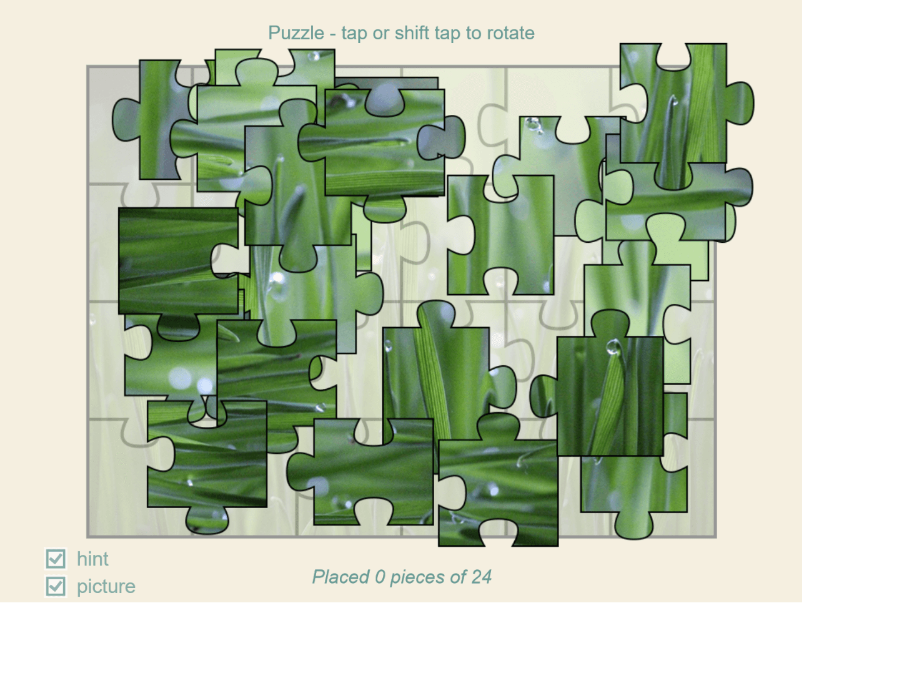

# Wordpress Puzzle Plugin

Plugin with which you can easily place puzzles on a given page using a shortcode. It has many settings that can also be
easily changed in a given shortcode.



## Installation

Download the repository as a ZIP package and upload it in the Wordpress administration panel.

## Usage

All you need to do is put the shortcode in the place where you want to put the puzzle.<br />
All pictures should be placed in the `images` folder in the plugin directory (`wp-content/plugins/wp-puzzle/*`).

**All pictures should be in 800px X 600px format!**

Sample shortcode:

```
[puzzle image="sample.jpg"]
```

## Configuration options

* ### `div_id` (default: `puzzle`)
  Ability to set the ID name of the div that contains the puzzle canvas.
* ### `width` (default: `1024`)
  The width of the canvas on which the puzzles are placed. It also includes size outside the main frame with buttons and
  texts.
* ### `height` (default: `768`)
  The height of the canvas on which the puzzles are placed. It also includes size outside the main frame with buttons
  and texts.
* ### `frame_color` (default: `null`)
  The background color of the main frame.
* ### `frame_outerColor` (default: `null`)
  The background color of the rest of the page
* ### `text_color` (default: `#679b95`)
  Color of text and buttons.
* ### `image` (default: `sample.jpg`)
  The image to be loaded from the "images" plugin directory
* ### `horizontal_pieces` (default: `6`)
  Number of horizontal elements the puzzle consists of.
* ### `vertical_pieces` (default: `4`)
  Number of vertical elements the puzzle consists of.
* ### `align_center` (default: `true`)
  A field with a value of true and false. It allows you to center the puzzle on the page.
* ### `label_text` (default: `Puzzle - tap or shift tap to rotate`)
  Text above the puzzle.

All options with default settings:

```
[puzzle div_id="puzzle" width="1024" height="768" frame_color="null" frame_outerColor="null" text_color=#679b95" image="sample.jpg" horizontal_pieces="6" vertical_pieces="4" align_center="true" label_text="Puzzle - tap or shift tap to rotate"]
```

## License

Plugin distributed under the GNU General Public License v3.0 License. See `LICENSE.txt` for more information.<br />
Puzzle javascript code released under the [ZIM.js](https://github.com/danzen/zimjs) license.